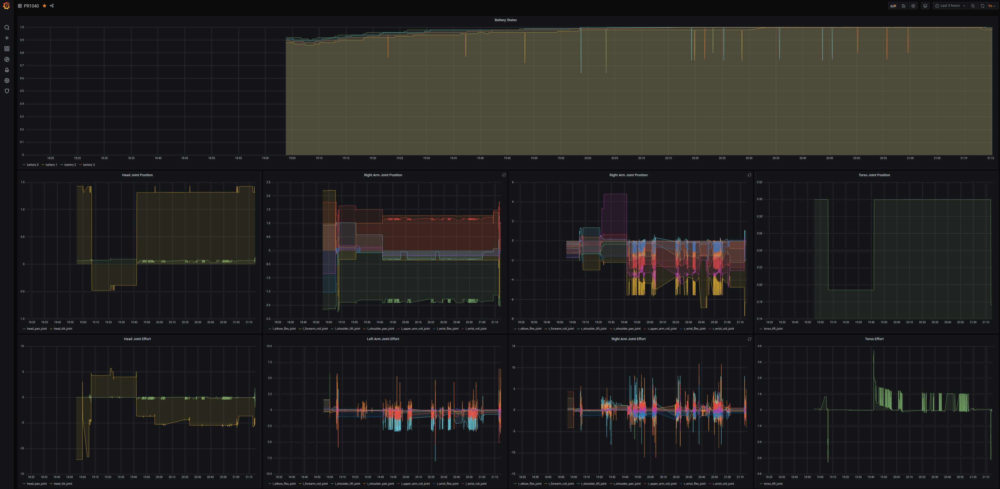

# influxdb_store

ROS package for influxdb store




## Sample

```bash
roslaunch influxdb_store pr2_influxdb_logger.launch
```

## Logger

### `joint_states_logger.py`

Logger for `sensor_msgs/JointStates`

#### Subscribing topic

- `~input` (`sensor_msgs/JointStates`)

Joint states topic name

#### Parameters

- `~host` (default: `localhost`)

Influxdb host address

- `~port` (default: `8086`)

Influxdb port number

- `~database` (default: `test`)

Influxdb database name

### `battery_states_logger.py`

Logger for `pr2_msgs/BatteryServer2`

#### Subscribing topic

- `~input` (`pr2_msgs/BatteryServer2`)

Battery topic name

#### Parameters

- `~host` (default: `localhost`)

Influxdb host address

- `~port` (default: `8086`)

Influxdb port number

- `~database` (default: `test`)

Influxdb database name
